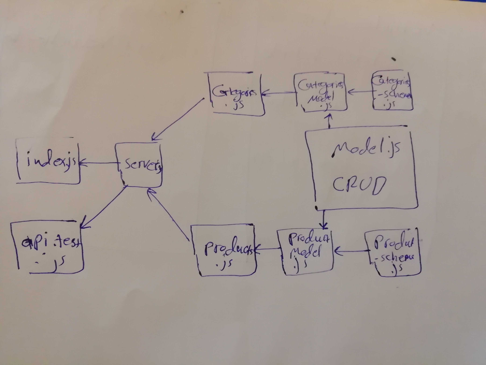

# LAB - Class 08

## Express Routing & Connected API

### Author: Ibrahim/Naseem/Obada

### Links and Resources

- [submission PR](https://github.com/401-advanced-javascript-ibrahim/express-routing/pull/1)
- [ci/cd](https://github.com/401-advanced-javascript-ibrahim/express-routing/actions) (GitHub Actions)

### Setup

#### `.env` requirements (where applicable)

- `PORT` - 3000
- `MONGODB_URI` - mongodb://localhost:27017/store

#### How to initialize/run your application (where applicable)

-`npm start`

#### Tests

- How do you run tests?
- Any tests of note?
- Describe any tests that you did not complete, skipped, etc

#### UML

